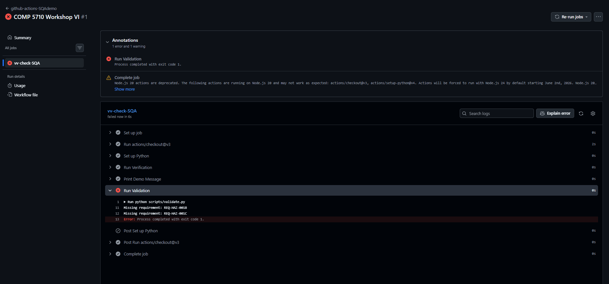
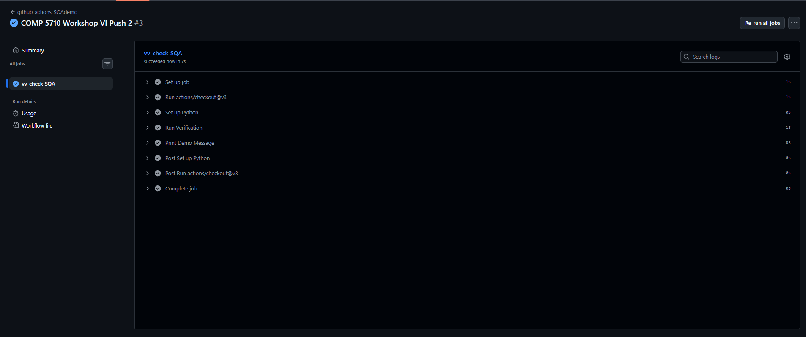
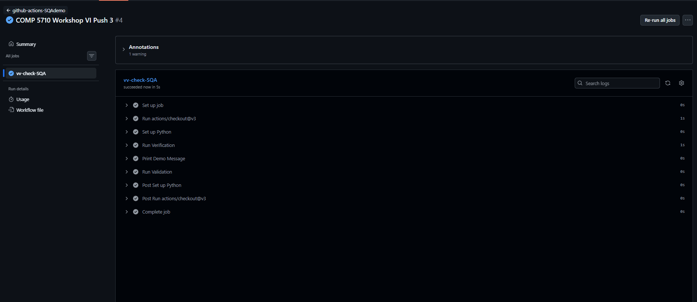

# Workshop 6: Validation, Verification, and CI with GitHub Actions

COMP 5710 - Software Quality Assurance


## Test Cases for B and C (Verification)

Added test cases for chemical and physical hazards to test_cases.json, then ran verification.

```json
[
  { "test_id": "TC-HAZ-001A", "requirement_id": "REQ-HAZ-001A" },
  { "test_id": "TC-HAZ-001B", "requirement_id": "REQ-HAZ-001B" },
  { "test_id": "TC-HAZ-001C", "requirement_id": "REQ-HAZ-001C" }
]
```


## Updated requirements.json (Validation)

Added REQ-HAZ-001B and REQ-HAZ-001C to requirements.json, then re-enabled and ran validation.

```json
[
  { "requirement_id": "REQ-HAZ-001A", "parent": "REQ-HAZ-001", "description": "Hazard analysis shall include biological hazards", "source": "117.130(a)" },
  { "requirement_id": "REQ-HAZ-001B", "parent": "REQ-HAZ-001", "description": "Hazard analysis shall include chemical hazards", "source": "117.130(b)" },
  { "requirement_id": "REQ-HAZ-001C", "parent": "REQ-HAZ-001", "description": "Hazard analysis shall include physical hazards", "source": "117.130(c)" }
]
```


## Build Failure

Push 1: requirements.json only had REQ-HAZ-001A. Validation failed because REQ-HAZ-001B and REQ-HAZ-001C were missing.




## Build Successes

Push 2: Run Validation commented out, test cases B and C added. Verification passed.



Push 3: requirements.json updated with B and C, Run Validation re-enabled. Both steps passed.




## Analysis

The build failed because validate.py checks that every requirement listed in expected_structure.json exists in requirements.json. Since B and C were missing, it exited with code 1 and the CI job failed.

To fix it, the Run Validation step was temporarily commented out to confirm verification was passing on its own. Then requirements.json was updated with the missing entries and validation was re-enabled, allowing the full pipeline to pass.
